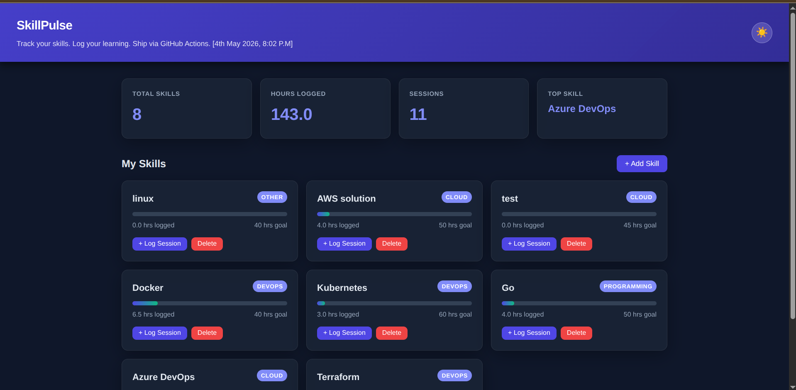
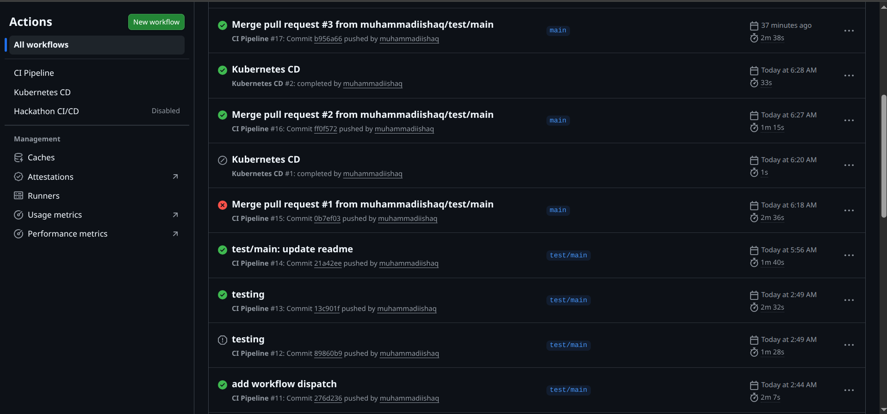
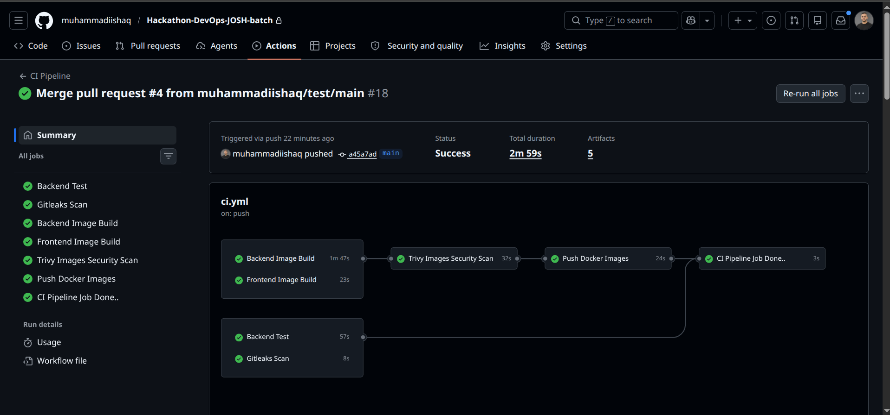
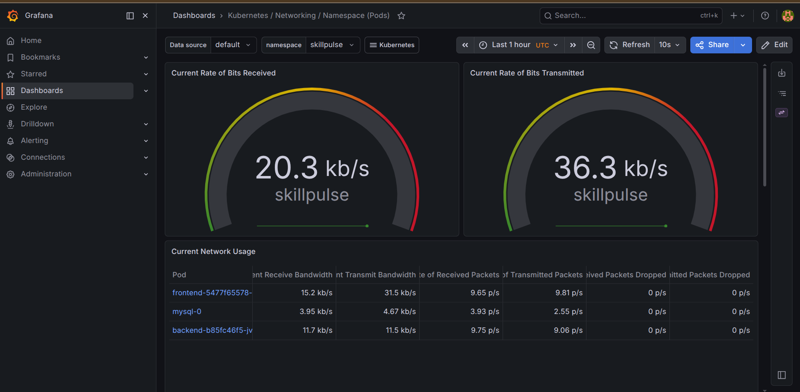
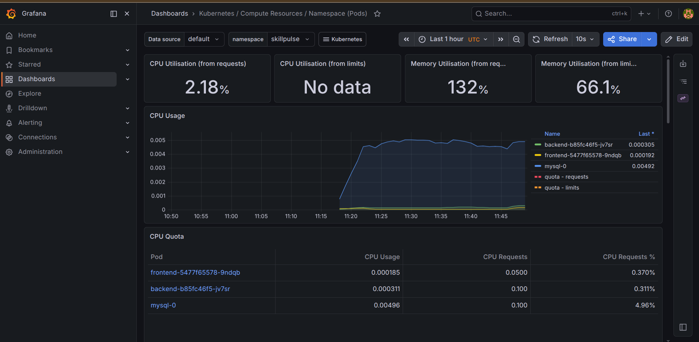
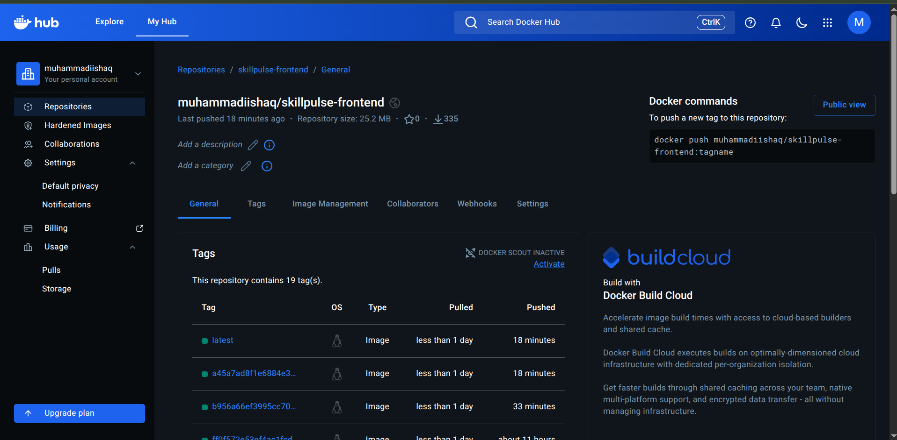

# 🚀 SkillPulse DevOps Project (Hackathon - Batch 10)



## Project Overview...
 
This project is part of the DevOps Hackathon (Batch 10) organized under the Zero to Hero program, mentored by **Shubham Bhaiya**. The hackathon focuses on building real-world DevOps skills by implementing complete CI/CD pipelines, containerization, Kubernetes deployment, and monitoring in a production-like environment.

## 📌 Hackathon Overview...

The goal of this hackathon is to simulate real industry workflows by:

- Building a full-stack application
- Containerizing services using Docker
- Implementing CI/CD using GitHub Actions
- Deploying on Kubernetes (K3s)
- Setting up monitoring using Prometheus & Grafana
- Following DevOps best practices (automation, scalability, observability)

## 💡 Project Structure..

SkillPulse is a full-stack web application built using:

- Backend: Golang (REST API)
- Frontend: HTML, CSS, JavaScript (served via Nginx)
- Database: MySQL
- Containerization: Docker
- Orchestration: Kubernetes (K3s)
- CI/CD: GitHub Actions
- Monitoring: Prometheus + Grafana + Loki

The application allows managing and tracking skills, logs, and dashboard insights through a simple UI and API.

## ⚙️ How It Works

This project follows a complete DevOps lifecycle:

Developer pushes code to GitHub
### CI pipeline:
- Builds Docker images
- Scans with Trivy
- Pushes images to Docker Hub
### CD pipeline:
- Updates Kubernetes manifests
- Deploys to EC2-based K3s cluster
### Monitoring stack:
- Prometheus collects metrics
- Grafana visualizes dashboards
- Loki collects logs



### 🚀 Deployment (Simple Steps).. 

1️⃣ Clone Repository
```
git clone https://github.com/your-username/your-repo.git
cd your-repo
```
2️⃣ Run with Docker (Local)
```
docker-compose up -d
```
3️⃣ Kubernetes Deployment
```
kubectl apply -f k8s/00-namespace.yaml
kubectl apply -f k8s/10-mysql.yaml
kubectl apply -f k8s/20-backend.yaml
kubectl apply -f k8s/30-frontend.yaml
```
4️⃣ Verify Deployment
```
kubectl get pods -n skillpulse
kubectl get svc -n skillpulse
```
5️⃣ Access Application

Use NodePort / LoadBalancer IP from:
```
kubectl get svc -n skillpulse
```


### 📊 Monitoring Stack
- Prometheus → Metrics collection
- Grafana → Visualization dashboards
- Loki → Log aggregation

### Step-by-Step Setup

1️⃣ Create Namespace
```
kubectl apply -f k8s/monitoring/01-namespace.yaml
```
2️⃣ Install Helm (if not installed)
```
curl https://raw.githubusercontent.com/helm/helm/main/scripts/get-helm-3 | bash
```
3️⃣ Install Prometheus + Grafana
```
helm repo add prometheus-community https://prometheus-community.github.io/helm-charts
helm repo update

helm install monitoring prometheus-community/kube-prometheus-stack -n monitoring
```
4️⃣ Install Loki (Logs)
```
helm repo add grafana https://grafana.github.io/helm-charts
helm repo update

helm install loki grafana/loki-stack -n monitoring
```
5️⃣ Expose Grafana
```
kubectl patch svc monitoring-grafana -n monitoring -p '{"spec": {"type": "NodePort"}}'
```
6️⃣ Get Grafana URL
```
kubectl get svc -n monitoring
```

👉 Open:
```
http://<EC2-IP>:<NodePort>
```
🔐 Default Login
```
Username: admin
Password:
kubectl get secret monitoring-grafana -n monitoring -o jsonpath="{.data.admin-password}" | base64 --decode
```




### 🛠️ Infrastructure (Terraform)

This project uses Terraform to provision an AWS EC2 instance and automatically set up the DevOps environment (Docker, Kubernetes, monitoring tools, etc.).

### 📌 Prerequisites

Before running Terraform, make sure you have:

- ✅ AWS Account
- ✅ Terraform installed locally
- ✅ AWS CLI installed & configured

1️⃣ Install Terraform your local machine

for Ubuntu machine setup..
```
sudo apt update
sudo apt install -y terraform
```
Verify Installation
```
terraform -version
```
2️⃣ Install AWS CLI
```
sudo apt install -y awscli
```
Verify:
```
aws --version
```
3️⃣ Configure AWS Credentials

Run:
```
aws configure

Enter your credentials:

AWS Access Key ID: YOUR_ACCESS_KEY
AWS Secret Access Key: YOUR_SECRET_KEY
Default region name: ap-south-1
Default output format: json
```

👉 You can get keys from:

AWS Console → IAM → Users → Security Credentials

4️⃣ Navigate to Terraform Directory
```
cd terraform
```
5️⃣ Initialize Terraform
```
terraform init
```
6️⃣ Validate Configuration
```
terraform validate
```
7️⃣ Preview Infrastructure
```
terraform plan
```
8️⃣ Create Infrastructure
```
terraform apply
```
Type:
yes

9️⃣ Get EC2 Public IP
```
terraform output
```
🔐 Connect to EC2
```
ssh -i ~/.ssh/your-key.pem ubuntu@<EC2-PUBLIC-IP>
```
⚙️ What Terraform Sets Up

🧹 Destroy Infrastructure (Cleanup)
```
terraform destroy
```

### CI/CD Pipelines (GitHub Actions)

This project uses GitHub Actions to automate the CI/CD process. In the CI stage, it builds Docker images, scans them with Trivy, and pushes them to Docker Hub. In the CD stage, it updates Kubernetes manifests with the latest image tags and deploys the application to the cluster. This ensures fast, secure, and automated deployments without manual effort.

Check files inside folder
```
cd .gtihub/workflow
```




### 🤝 Contribution

This project is part of a learning hackathon, but improvements and ideas are always welcome.

### Muhammad Ishaq


